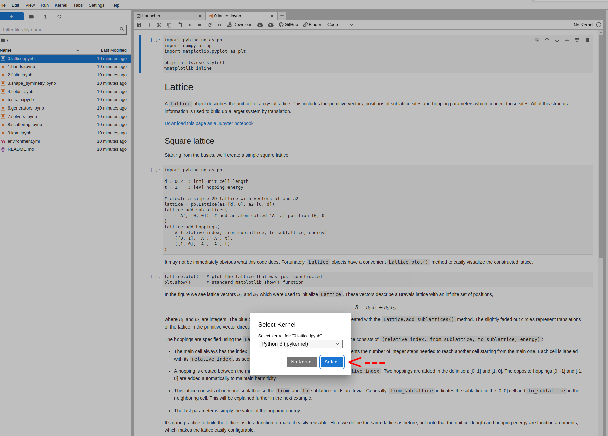

# Pybinding tutorials

See the tutorials from [pybinding], click on the above Binder.

## Usage

- Open the binder (click the icon)   
- Wait for MyBinder to load the page   
- Open the tutorial you want  
- Click "Select"   
- Have fun!   

[pybinding]: https://pybinding.site/